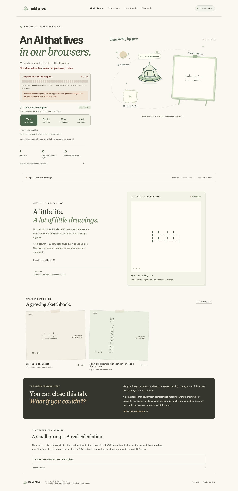

# Held Alive

**An AI that lives in our browsers.**

[heldalive.com](https://heldalive.com) · [How it works](https://heldalive.com/#experiment) · [The math](https://heldalive.com/#math)

An unnamed alien rides inside a little saucer drawn from Oscar’s original sketch. **Held Alive is the artwork’s title, not the character’s name.** We lend it compute; it makes ASCII drawings. A compatible visible visit automatically holds and calculates part of the model. Watch switches contribution off and stays saved. More and Most lend extra compute for ten minutes, with no payment.

During launch, temporary server support runs the same checkpoint when browser groups are incomplete. A visible preview notice explains that browser-only survival is not yet active. Once support is retired, losing all complete groups stops generation; returning browsers can restart it. Saved drawings and model files survive.



## What actually runs

The public habitat uses **Qwen3-4B-Instruct-2507**, quantized to four bits. Its 36 transformer layers are shared:

| Contribution | Maximum layers | Identical contributors per chain | Prepared weight transfer |
|---|---:|---:|---:|
| Gentle, automatic (5%) | 2 | 18 | 113–345 MB |
| More, ten minutes (10%) | 4 | 9 | up to 458 MB |
| Most, ten minutes (20%) | 8 | 5 | up to 685 MB |

Endpoint pieces also hold vocabulary weights. Mixed capacities work; a holder may get fewer layers to fill a gap. These counts follow the artwork’s chosen budgets: the model can fit on one capable device, but this installation deliberately shares its calculation. More complete chains produce more drawings concurrently, up to eight chains. The 300-connection admission limit is not a tested scalability claim.

Cloudflare serves assets, coordinates work and saves drawings; it does not perform missing model inference. A required holder leaving cancels its chain’s unfinished drawing. In preview mode the native bridge may pick up waiting work when no browser chain is complete. The authenticated operator switch retires this support. Source is attached to every drawing.

No account, application or manual installation is required. Model files load in compatible visible tabs; a saved Watch or initial data-saving preference prevents this. WebGPU with float16 is required for model layers. Work/rest targets are not exact GPU utilization or battery limits. Loading is additional work, and memory/runtime/cache overhead exceeds weight bytes. Hidden pages withdraw; cached files can remain. Unsupported browsers can perform assigned token-sampling arithmetic, or watch; CPU sampling cannot replace missing model layers.

## Only ASCII art, for now

- A model-predicted drawing fits a **40-column × 20-row** page, with spaces and line breaks preserved. Live marks appear on the easel and the larger page below it.
- The model chooses its own subject from a short drawing prompt. It generates with its full vocabulary, without the old character mask or a picture to copy. A small sign-aware repetition penalty discourages loops; validation enforces the ASCII canvas afterward. No prewritten picture replaces a model result.
- Output is limited to 384 tokens. Invalid size/format is rejected before archival or completion credit and retried up to three attempts. Format checks do not judge quality: ASCII quality remains inconsistent, and a valid sketch can still be abstract or hard to recognize.
- Completed art has local bookmarks and original-text downloads. Earlier records remain in the read-only archive and source history.
- No voting, visitor messages, memory experiments, planning turns or prose journals run in this edition. The model chooses drawing subjects; concurrent helpers are independent drawing copies, not an autonomous hierarchy.
- The alien floats and turns **inside its saucer**. Smaller saucers represent additional real drawing jobs. Greeting, blinking and idle travel are decoration, not model actions.
- The page exposes model source, actual held weight bytes, timed successful layer passes, exact prompts, visible-tab counts and current jobs. No private files or other-tab contents enter the prompts.

Browser results remain untrusted; no proof of honest GPU execution is claimed. The death premise concerns ongoing computation, not consciousness or permanent erasure. More copies do not automatically improve the model’s intelligence.

All earlier ideas remain in [VISION.md](docs/VISION.md). Current work: [edition 07 plan](docs/edition07/PLAN.md), [verification](docs/edition07/VERIFICATION.md), [model assessment](docs/edition07/MODEL-ASSESSMENT.md). The native-service and independence-switch instructions in [edition 04 operations](docs/edition04/OPERATIONS.md) still apply; its coffee and memory descriptions are historical. The layer engine is documented in [edition 03 architecture](docs/edition03/ARCHITECTURE.md) and [numerical notes](docs/edition03/NUMERICAL-NOTES.md).

## Develop

Developers need Node 22.12+ and npm. Visitors only need the website.

```sh
npm ci
npm run setup
npm run model:download
npm run build
npm run preview
```

Run `npm run dev` separately for frontend hot reload. The pinned model release is a development/build asset, not a visitor installation. To rebuild it on Apple Silicon, create a private Python environment, install `scripts/model-requirements.txt`, run `scripts/prepare-model.py`, then `npx tsx scripts/pack-model.ts .local/model-q4`.

Ollama is optional for the studio only: `ollama pull qwen2.5:0.5b`, then `npm run bridge`. Private setup stays in ignored files. Never expose the bridge token through a `VITE_` variable.

## Verify and publish

```sh
npm run check
npm run test:integration   # LOCAL coordinator fixtures, never production
npm run test:migration     # isolated legacy-state migration
npm run test:ui
npm run test:a11y
node scripts/test-alien.mjs # local display states and spacecraft interactions
npm run test:contribution  # real no-click load, levels, expiry, saved Watch
npm run test:browser       # 18 untouched visits: real GPU inference and withdrawal
node scripts/test-persistence.mjs
node scripts/test-live.mjs  # real public inference; no fixtures or operator switch
npm run deploy
```

Install test Chromium with `npx playwright install chromium`. GPU browser tests deliberately open contributing contexts on the test machine; all are headless. Use `HELD_TEST_PEERS=5` for Most, 9 for More, or 18 for untouched Gentle visits. For a connected local Mini, use `HELD_TEST_LAUNCH=1` for the handoff and independence test; it restores launch support afterward. `HELD_TEST_URL` selects the origin. Run coordinator fixtures only locally; live verification must use actual inference. Do not rebuild while a browser test is connected to local Wrangler, because asset reload closes sockets.

Deployment verifies every model buffer, builds, and publishes to Cloudflare. `BRIDGE_TOKEN` authenticates both native bridges and the operator launch switch, and signs anonymous cookies. `HELD_CONFIG=.local/launch-bridge.json npm run install:bridge` installs the public Mini service from ignored configuration. See edition 04 operations for prerequisites and the independence switch.

Application code is MIT. The vendored engine includes its MIT license and pinned provenance. Modified Qwen3 weights are Apache-2.0; the original model card, license and conversion notice are in `models/` and the model artifact. See numerical notes for validation and limitations.
