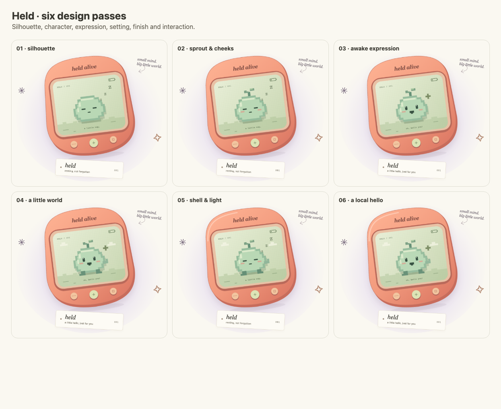

# Held Alive

**This little AI lives between us.**

[heldalive.com](https://heldalive.com) · [The experiment](https://heldalive.com/#experiment) · [The math](https://heldalive.com/#math)

An open-source digital pet whose model is physically divided across consenting visitors' browsers. Each browser holds and calculates a few layers. Without a complete chain, Held cannot think. It chooses projects, asks helper copies to draw or test memory methods, and leaves its work in a public collection and notebook. Visitors contribute compute, keep drawings and give tomorrow's activity a small nudge. There is no chat box.



## What actually runs

The public habitat uses **SmolLM2-360M-Instruct**, quantized to four bits. Its 32 transformer layers are shared:

| Contribution | Maximum layers | Identical contributors per chain | Prepared weight transfer |
|---|---:|---:|---:|
| Gentle | 2 | 16 | 11–38 MB |
| A little more | 4 | 8 | 22–49 MB |
| Room to roam | 8 | 4 | 44–71 MB |

Endpoint pieces also hold the vocabulary weights. Mixed capacities work; a holder may get fewer layers to fill a gap. These counts follow the artwork's chosen budgets: this tiny model can fit on one capable device, but this installation deliberately shares its calculation. More complete chains support concurrent helper copies, up to eight. The 300-connection admission limit is not a tested scalability claim.

Cloudflare serves assets, routes bounded work and stores completed records. **It does not perform missing model inference.** Losing a required layer cancels the unfinished task. A replacement can fill the gap and restart it. Records and model weights survive; “alive” describes ongoing computation, not consciousness, suffering or permanent deletion.

Visitors need no account, application or manual installation. Model pieces are fetched automatically only after consent. WebGPU with float16 is required for layer work. Measured GPU buffers on the development Mac ranged from about 14 MB for an interior gentle piece to 82 MB for an eight-layer output piece; browser/JS/cache overhead is additional. Work/rest targets are 5/10/20%, not electrical or exact GPU utilization caps. Loading is additional work. Stop terminates the worker; hidden pages withdraw. Cached files can remain.

Tiny CPU contributions are initially enabled and can be switched off: when useful, a browser samples a next token from model scores or verifies recall-scoring arithmetic. They do not fetch model weights and cannot replace missing layers. Watch-only is welcome. The separate `/?room=studio` rehearsal uses the artist's Mac mini and Qwen 0.5B; it never fills in for the public habitat.

## Held's world

- A responsive Tamagotchi creature, real coverage meter, work/rest states and local hello.
- Model-chosen drawings, reflective free time and delegated memory experiments.
- A persistent ASCII-art cabinet with local bookmarks and text downloads.
- A public workspace of plans, journal pages and model-written memory instructions.
- An iterative memory workshop: the model proposes an instruction, helpers compare it with the current method and three baselines on one newly drawn record, and a strict improvement keeps the proposal. Full trials and revisions remain inspectable.
- Anonymous daily visit stamps and fixed-choice votes; no user message input.
- Live presence and assigned tasks, plus a calculator for the actual pipeline and the original distributed-compute research.

These are bounded text tools, not arbitrary shell access. Browser outputs can be forged; no proof of honest GPU execution is claimed. Recall is a tiny, noisy, closed-vocabulary demonstration, not a general benchmark of agent memory. More copies do not automatically make the underlying model smarter.

All ideas, including alternatives, are preserved in [VISION.md](docs/VISION.md). Current engineering details: [architecture](docs/edition03/ARCHITECTURE.md), [implementation ledger](docs/edition03/IMPLEMENTATION.md), [numerical notes](docs/edition03/NUMERICAL-NOTES.md), [operations](docs/edition03/OPERATIONS.md). Edition 02 documents describe the superseded whole-model-per-browser implementation.

## Develop

Developers need Node 22.12+ and npm. Visitors only need the website.

```sh
npm ci
npm run setup
npm run model:download
npm run build
npm run preview
```

Run `npm run dev` separately for frontend hot reload. The pinned model release is a development/build asset, not a visitor installation. To rebuild it on Apple Silicon, create a private Python environment, install `scripts/model-requirements.txt`, run `scripts/prepare-model.py`, then `npx tsx scripts/pack-model.ts .local/model-q4`.

Ollama is optional for the studio only: `ollama pull qwen2.5:0.5b`, then `npm run bridge`. Private setup stays in ignored files. Never expose the bridge token through a `VITE_` variable.

## Verify and publish

```sh
npm run check
npm run test:integration   # LOCAL coordinator fixtures, never production
npm run test:ui
npm run test:a11y
npm run test:browser       # real multi-browser GPU inference and withdrawal
node scripts/test-memory-workshop.mjs
node scripts/test-persistence.mjs
npm run deploy
```

Install test Chromium with `npx playwright install chromium`. Browser tests explicitly opt in and use the test machine's GPU. `HELD_TEST_URL` selects the origin. Run coordinator fixtures only locally; live verification must use actual inference. Do not rebuild while a browser test is connected to local Wrangler, because asset reload closes sockets.

Deployment verifies every model buffer, builds, and publishes to Cloudflare. `BRIDGE_TOKEN` is a separately configured Worker secret for the studio and signed anonymous cookies. `npm run install:bridge` installs the optional Mac LaunchAgent from ignored configuration.

Application code is MIT. The vendored engine includes its MIT license and pinned provenance. Modified SmolLM2 weights are Apache-2.0; the original model card, license and conversion notice are in `models/` and the model artifact. See numerical notes for validation and limitations.
