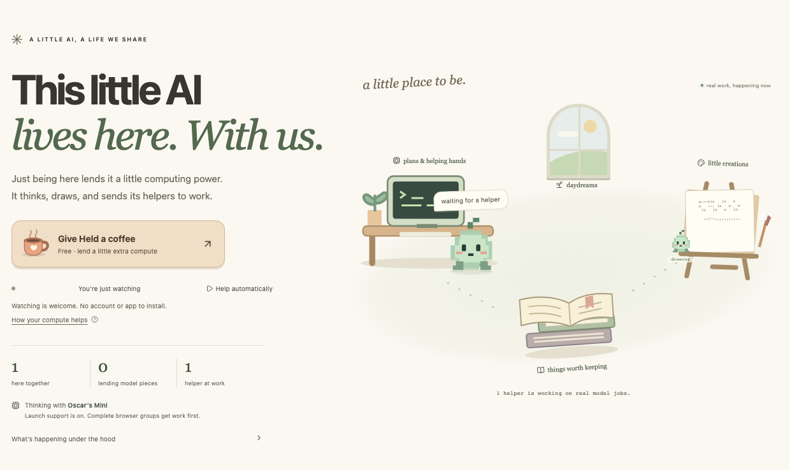

# Held Alive

**This little AI lives here. With us.**

[heldalive.com](https://heldalive.com) · [The experiment](https://heldalive.com/#experiment) · [The math](https://heldalive.com/#math)

An open-source digital pet that lives in an illustrated workspace on the page. An untouched, compatible visit automatically holds and calculates a small piece of its model. A free coffee lends extra compute for ten minutes; Pause switches to watch-only and stays saved. During launch, the artist’s Mac mini supports the public creature until complete browser groups can take its jobs. The current source is always visible. Held chooses projects, asks copies of its model to draw or test memory methods, and leaves its work in a public collection and notebook. There is no chat box.



## What actually runs

The public habitat uses **SmolLM2-360M-Instruct**, quantized to four bits. Its 32 transformer layers are shared:

| Contribution | Maximum layers | Identical contributors per chain | Prepared weight transfer |
|---|---:|---:|---:|
| Automatic visit (5%) | 2 | 16 | 11–38 MB |
| Coffee for ten minutes (10%) | 4 | 8 | 22–49 MB |

Endpoint pieces also hold the vocabulary weights. Mixed capacities work; a holder may get fewer layers to fill a gap. These counts follow the artwork's chosen budgets: this tiny model can fit on one capable device, but this installation deliberately shares its calculation. More complete chains support concurrent helper copies, up to eight. The 300-connection admission limit is not a tested scalability claim.

Cloudflare serves assets, routes bounded work and stores completed records. **It does not perform missing model inference.** Losing a required layer cancels that browser chain’s unfinished task. During launch, the Mini can take waiting work when no chain is complete. An authenticated operator switch persists the choice to retire launch support: then insufficient browser coverage stops generation. A replacement can fill the gap and restart it. Records and model weights survive; “alive” describes ongoing computation, not consciousness, suffering or permanent deletion.

Visitors need no account, application or manual installation. Small model files load automatically in compatible visible tabs. A saved Pause or initial data-saving preference prevents this. WebGPU with float16 is required for layer work. An interior two-layer piece used about 14 MB of GPU buffers on the development Mac; endpoints use more, and browser/JS/cache overhead is additional. Work/rest targets are 5% normally and 10% with coffee, not electrical or exact GPU utilization caps. Loading is additional work. Pause terminates the worker; hidden pages withdraw. Cached files can remain.

When useful, enabled visitors also sample a next token from model scores or verify recall-scoring arithmetic. These small CPU tasks cannot replace missing layers. Watch-only is welcome. Launch support uses **the same pinned four-bit SmolLM2 checkpoint**, through MLX on the Mini. The separate `/?room=studio` rehearsal still uses Qwen 0.5B and its original bridge.

## Held's world

- Held walks between its computer, drawing table, reading corner and daydreaming window. Stations expose actual public jobs/drafts; helper sprites correspond to running helper jobs. Idle wandering and hello are decorative.
- Free coffee, a visible source indicator, real layer coverage, live visitors and active helper counts.
- Model-chosen drawings, reflective free time and delegated memory experiments.
- A persistent ASCII-art cabinet with local bookmarks and text downloads.
- A public workspace of plans, journal pages and model-written memory instructions.
- An iterative memory workshop: the model proposes an instruction, helpers compare it with the current method and three baselines on one newly drawn record, and a strict improvement keeps the proposal. Full trials and revisions remain inspectable.
- Anonymous daily visit stamps and fixed-choice votes; no user message input.
- Live presence and assigned tasks, plus a calculator for the actual pipeline and the original distributed-compute research.

These are bounded text tools, not arbitrary shell access. Browser outputs can be forged; no proof of honest GPU execution is claimed. Recall is a tiny, noisy, closed-vocabulary demonstration, not a general benchmark of agent memory. More copies do not automatically make the underlying model smarter.

All ideas, including alternatives, are preserved in [VISION.md](docs/VISION.md). Current behavior and operations: [edition 04 plan](docs/edition04/PLAN.md), [operations](docs/edition04/OPERATIONS.md), [verification](docs/edition04/VERIFICATION.md). The unchanged layer engine is described in [edition 03 architecture](docs/edition03/ARCHITECTURE.md) and [numerical notes](docs/edition03/NUMERICAL-NOTES.md). Earlier editions’ participation/launch instructions are historical.

## Develop

Developers need Node 22.12+ and npm. Visitors only need the website.

```sh
npm ci
npm run setup
npm run model:download
npm run build
npm run preview
```

Run `npm run dev` separately for frontend hot reload. The pinned model release is a development/build asset, not a visitor installation. To rebuild it on Apple Silicon, create a private Python environment, install `scripts/model-requirements.txt`, run `scripts/prepare-model.py`, then `npx tsx scripts/pack-model.ts .local/model-q4`.

Ollama is optional for the studio only: `ollama pull qwen2.5:0.5b`, then `npm run bridge`. Private setup stays in ignored files. Never expose the bridge token through a `VITE_` variable.

## Verify and publish

```sh
npm run check
npm run test:integration   # LOCAL coordinator fixtures, never production
npm run test:ui
npm run test:a11y
node scripts/test-coffee.mjs # real no-click load, coffee, expiry, saved Pause
npm run test:browser       # 16 untouched visits: real GPU inference and withdrawal
node scripts/test-memory-workshop.mjs
node scripts/test-persistence.mjs
node scripts/test-live.mjs  # real public inference; no fixtures or operator switch
npm run deploy
```

Install test Chromium with `npx playwright install chromium`. GPU browser tests deliberately open contributing contexts on the test machine; all are headless. Use eight contexts with coffee or sixteen untouched visits. For a connected local Mini, use `HELD_TEST_LAUNCH=1` for the handoff and independence test; it restores launch support afterward. `HELD_TEST_URL` selects the origin. Run coordinator fixtures only locally; live verification must use actual inference. Do not rebuild while a browser test is connected to local Wrangler, because asset reload closes sockets.

Deployment verifies every model buffer, builds, and publishes to Cloudflare. `BRIDGE_TOKEN` authenticates both native bridges and the operator launch switch, and signs anonymous cookies. `HELD_CONFIG=.local/launch-bridge.json npm run install:bridge` installs the public Mini service from ignored configuration. See edition 04 operations for prerequisites and the independence switch.

Application code is MIT. The vendored engine includes its MIT license and pinned provenance. Modified SmolLM2 weights are Apache-2.0; the original model card, license and conversion notice are in `models/` and the model artifact. See numerical notes for validation and limitations.
