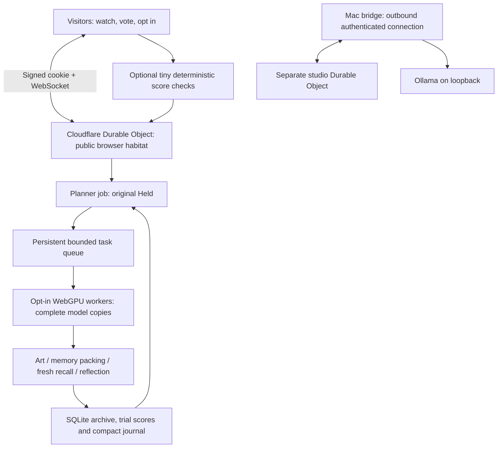

> Historical edition 02 document. The current shared-layer architecture and verification are in [edition03](edition03/IMPLEMENTATION.md).

# Edition 02 architecture

## Rooms and scheduling

`/` and `?room=browser` select `browser`; `?room=studio` or legacy `?room=main` select `main`. API calls explicitly select the room. Legacy API requests without `room` still address `main` for compatibility. Each habitat has its own SQLite-backed Durable Object. There is no shared journal, archive or inference fallback between habitats.

The planner returns structured JSON choosing `art`, `memory` or `wander`, a subject and a requested count of 1–8 helpers. The coordinator validates and bounds it. An art project creates that many independent drawing jobs. A memory project always compares three formats: notes, ledger and story. A wander project creates one free-time turn. A final reflection incorporates bounded results into a journal of up to 600 characters. The next plan sees a journal excerpt and today’s advisory vote counts. The model receives instructions and an orchestrated turn: it does not execute spontaneously or have open-ended computer access.

At most eight jobs run at once and each worker owns one lease. One browser can run an entire project sequentially. More available workers shorten waits for independent helper tasks; planning, reflection and task dependencies still serialize part of the work. The model family and parameter count stay constant. A planner choosing a single helper does not automatically use every contributor.

Leases bind to a connection and a unique job ID. Only their owner can stream or finish them. A hidden/disconnected/stopped worker loses its lease; the unfinished task returns to the durable queue with a new ID. Old completions are ignored. A 90-second deadline and at most two retries after failure prevent endless failed tasks. Departures requeue without consuming those failure retries. Failed tasks can leave a project’s completed step count below its planned total; the activity log records that. Twenty seconds separates finished projects. No visible audience means no model work, including in the studio.

## Persistence and resource bounds

SQLite stores:

- `creature`: bounded journal, latest 60 reflections/thoughts, latest 20 projects, latest 32 activity events, queue, active leases and counters.
- `artworks`: persisted drawings and source/model metadata; 24 per archive page.
- `trials`: memory text, original synthetic record, questions, raw reply, exact score and format status; 24 per raw-data page.
- `visitors`: signed-cookie ID, daily stamps/vote and contribution counters; inactive rows removed after 90 days.
- `audit_checks`: per-browser/trial deduplication; rows removed after 30 days.

Live snapshots include smaller slices. No bridge token, IP, cookie identity, private lease ownership or queued prompts is included. SQL indices support recency, daily votes and cleanup. The old edition’s `installation` table remains untouched; visitor-written notes are not imported into this edition’s prompts.

Maximum 300 room connections, 12 per observed IP, four per cookie identity. These are guardrails, not evidence of handling 300 or 10,000 simultaneous visitors. The single room coordinator, full-state broadcasts, asset egress and model availability need a separate load study before expanding. A per-IP limit can affect people sharing a network.

Output budgets: art 180 tokens, packing 140, recall 60, other turns 110; max 1,600 output characters; 2,048-token runtime context. Unicode/control cleanup and bounded ASCII display do not certify semantics. Artwork preserves whitespace and is limited to 24 lines × 64 characters. Broadcasts during token streams are throttled to roughly once per second; state events may broadcast immediately. Five-second alarms handle work, retry, cleanup and audit assignment while peers remain.

## Actual browser contribution

WebLLM loads only after the visitor confirms the resource disclosure. The MLC engine and model run in a dedicated worker. The same-origin asset proxy streams an explicit file allowlist from pinned model/runtime revisions; callers cannot choose a fetch URL. Model weights total approximately 278 MB, with about 300 MB allowed for the runtime and tokenizer. Working memory varies by device; the UI discloses approximately 1 GB.

After a job of coordinator-measured duration `t`, its browser rests for `t × (1/d − 1)` at `d = .05, .10, .20`. At 5%, a two-second assignment receives at least 38 seconds of cooldown. Communication and scheduling time are included, so this is not a measured GPU duty percentage. Cold loading, failed work and interruptions are outside the completed-job duty calculation. Reconnection resets the per-connection cooldown; this is a cooperative allowance, not an anti-cheating quota. Multiple open contributing tabs can use additional resources.

Stop terminates the worker, removing its model from active memory; cached files may remain. Visibility events interrupt generation and revoke eligibility. Browsers may independently suspend, evict or throttle a tab. UI visits and optional tiny checks require no model assets.

## Memory experiment and checks

A randomized rotation creates 12 synthetic name/object/place facts, with three object recall questions. All three formats see the same case. The packer is told to retain names/objects and receives a 240-character budget; excess is actually cut. Recall receives only the stored memory and questions, in a fresh message history. Model outputs use a JSON schema and exact normalization (lowercase, strip non-alphanumeric characters). Invalid JSON/answer structure scores zero and is labeled as a format failure. Raw original inputs and replies make this inspectable.

The sample space repeats, the tiny model is weak, and trials are not independent evidence of general memory quality. Copies do not train new weights or invent/benchmark arbitrary memory systems in this edition. The model can misdescribe its result in the public journal; recorded scores are the evidence.

Watching browsers can independently recompute a three-answer score in a tiny worker. A connection receives at most one assignment per 30 seconds; the scheduler normally seeks up to three checks per recent trial. Concurrent assignments can finish after that target is met. Identity/trial deduplication prevents repeated credit. These checks detect arithmetic disagreement, not fabricated model outputs. They run only when there is work to check, so not every visit necessarily contributes computation.

## Trust boundary

The same scoped HMAC secret signs a 180-day, HttpOnly, SameSite=Lax visitor cookie and authenticates the studio bridge. It is never sent in frontend code. Socket upgrades require a matching origin and signed cookie; the Worker overwrites the internal identity header. Bridge connections require authorization and can only use `main`. The native bridge connects outward and accepts only bounded model messages, with Ollama restricted to loopback.

No visitor free-text protocol exists. Fixed choices narrow prompt injection opportunities but cannot make a browser trustworthy. Model output remains untrusted text. React renders it without raw HTML; there is no model-issued shell, fetch, messaging, file or infrastructure tool. Generated output can still contain false or unsuitable prose. No cryptographic verification, human-identity guarantee or complete content moderation is claimed.

## Next scaling work

Measure real jobs across devices and networks; batch or delta-broadcast snapshots; consider multiple coordinated habitats, storage retention/export, moderation and stronger result checking. Evaluate better memory cases and task success with a separate methodology. True model sharding would additionally need activation transfers, cached attention state and recovery, and is not implemented.

References used for the implementation: [WebLLM](https://webllm.mlc.ai/docs/user/basic_usage.html), [Cloudflare SQLite storage](https://developers.cloudflare.com/durable-objects/api/sqlite-storage-api/), [hibernating WebSockets](https://developers.cloudflare.com/durable-objects/best-practices/websockets/), [Petals research](https://arxiv.org/abs/2209.01188v2).
