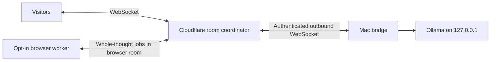

# Architecture and stages

## Current implementation

`main` and `browser` are separate rooms, each with its own Durable Object and SQLite state. There is one serialized model job per room. Worker job leases identify the authorized connection and expire after 90 seconds. Disconnect, hidden-tab withdrawal, and explicit Stop cancel the assignment. Partial canceled output is not committed as a complete thought. Late or unauthorized output cannot commit another worker's job.

The Mac makes an outbound connection: neither port 11434 nor a general local proxy is exposed to the internet. The coordinator supplies bounded chat messages for a fixed model, not executable code or arbitrary fetch destinations. Browser tasks use a bundled inference engine in a separate worker.

Browser model downloads use a same-origin, streaming Worker endpoint with an explicit filename allowlist and pinned model/library commit revisions. It cannot fetch an arbitrary caller-provided URL. This avoids the model host's missing cross-origin headers on the deployed origin. The browser variant has 278 MB of weight shards; allow approximately 300 MB including tokenization/runtime assets and roughly 1 GB working memory, depending on device/runtime.

State is saved before each broadcast; completed thoughts survive Durable Object hibernation. Connection metadata uses WebSocket attachments. At most 60 thoughts, 3 pending notes, 250 room connections, and 12 connections per source IP are accepted. Notes are limited to 180 characters and one per connection per 30 seconds. A room-level bound also constrains total note throughput. These are modest art-installation protections, not a substitute for an adversarial public-load assessment.

## Contribution accounting

For a completed browser task measured over duration `t`, the scheduler assigns a cooldown of `t × (1/d − 1)`, where `d` is 0.05, 0.10, or 0.20. A 2-second thought at 5% duty is followed by at least 38 seconds of rest. Measurement includes job/communication time, so it is conservative relative to kernel-only time. Cold model loading is outside this steady duty estimate. Anonymous users can reload and obtain a new connection, so the allowance is an honest client feature rather than an anti-cheating identity system.

Current metrics report model output tokens and wall time of completed inference assignments. They are not energy measurements or proof of honest GPU work. Untrusted browser results remain an experimental limitation.

## Stage boundary: literal collective dependence

The user ultimately wants an AI whose individual thoughts require several people's devices. The current Mac-hosted study is authorized as the initial test. The working browser study establishes actual opt-in inference, consent, availability, and withdrawal. It shares complete jobs, so it does **not** implement that multi-host dependency yet.

The next production stage is model sharding: partition required layers among browsers, measure activation-transfer latency, preserve/rebuild attention caches on handoff, and schedule only complete connected inference chains. A missing required shard must halt actual inference. Additional contributors may replicate shards or host more layers within their budgets. Do not use an arbitrary visitor-count cutoff or a simulated compute meter.

Before enabling that stage publicly:

1. Benchmark each shard on representative laptop and phone browsers with the same context and token budget.
2. Measure serial network latency and full-chain token rate; aggregate FLOPs alone are insufficient.
3. Verify failure mid-token, shard reassignment, KV-cache recovery, and correlated tab suspension.
4. Choose a documented response-rate target and disclose that fewer hosts may mean slower inference rather than irrecoverable “death.”
5. Audit any imported peer-to-peer runtime and validate its worker protocol.

Starting references: [LLMlet](https://github.com/ktock/llmlet), [Petals research](https://arxiv.org/abs/2312.08361), [WebLLM](https://github.com/mlc-ai/web-llm). These are references, not claims that those projects have been audited or integrated here.
